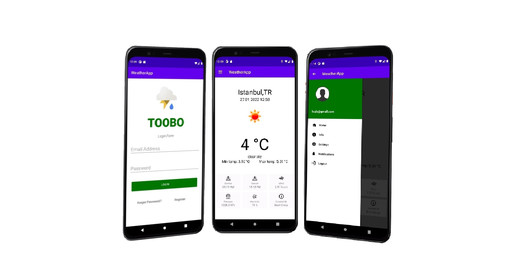

# :sunny: TooBo - Weather- App :cloud:

## A Propos
Application de prévisions météo utilisant Java pour Android.
Ce projet porte sur la création d'une application météo Android à l'aide de Java. Pour obtenir les informations météorologiques, nous avons utilisé l'API OpenWeatherMap. Des informations telles que la température, la pression, l'humidité, l'état météorologique, l'heure du lever et du coucher du soleil, etc. sont transmises à partir de l'API.

Vous devez d'abord vous connecter à l'application. Il existe également des options telles que le mot de passe oublié. Ensuite, vous pouvez connaître les conditions météorologiques de la ville que vous souhaitez dans votre compte personnel, consulter et modifier vos informations personnelles.

     

## Exigences

* Android studio last version
* JDK 11
* Android SDK 31
* Supports API Level +21
* Material Components 1.5.0-alpha04
* Vous devez configurer Firebase dans votre propre compte
* Taille de la machine virtuelle : 1440 x 3040 ou 1080 x 2160

	
## Dépendances externes

Voici les API/services externes utilisés pour cette application :
* OpenWeatherMap `(https://openweathermap.org/current)` La principale API utilisée pour les données météorologiques.
Plus précisément, nous utilisons la fonction Données météorologiques actuelles. 
* Un service de session privée est fourni aux utilisateurs. `( https://firebase.google.com/ )`
* Picasso - `( https://square.github.io/picasso/ )` Utilisé pour charger des images dans l'application de manière simple.

## Licence

Copyright (c) 2020 Hacer AKTURK, Kenza BENDOU, Furkan KARA

Permission is hereby granted, free of charge, to any person obtaining a copy of this software and associated documentation files (the "Software"), to deal in the Software without restriction, including without limitation the rights to use, copy, modify, merge, publish, distribute, sublicense, and/or sell copies of the Software, and to permit persons to whom the Software is furnished to do so, subject to the following conditions:

The above copyright notice and this permission notice shall be included in all copies or substantial portions of the Software.

THE SOFTWARE IS PROVIDED "AS IS", WITHOUT WARRANTY OF ANY KIND, EXPRESS OR IMPLIED, INCLUDING BUT NOT LIMITED TO THE WARRANTIES OF MERCHANTABILITY, FITNESS FOR A PARTICULAR PURPOSE AND NONINFRINGEMENT. IN NO EVENT SHALL THE AUTHORS OR COPYRIGHT HOLDERS BE LIABLE FOR ANY
CLAIM, DAMAGES OR OTHER LIABILITY, WHETHER IN AN ACTION OF CONTRACT, TORT OR OTHERWISE, ARISING FROM, OUT OF OR IN CONNECTION WITH THE SOFTWARE OR THE USE OR OTHER DEALINGS IN THE SOFTWARE.

