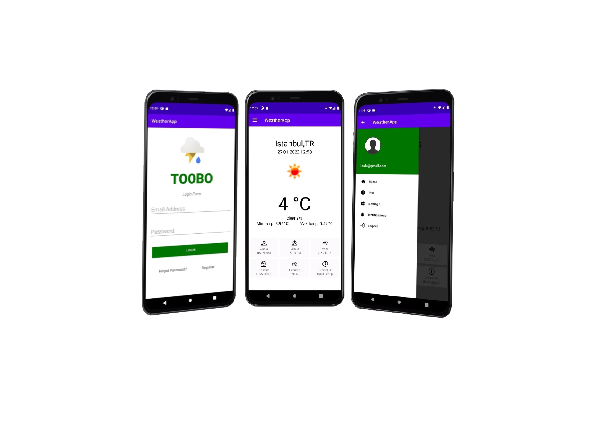

# TooBo - Weather- App
	pplication de prévisions météo utilisant Java pour Android.

## - Exigences

	Android studio last version
	JDK 11
	Android SDK 31
	Supports API Level +21
	Material Components 1.5.0-alpha04
	

## - Dépendances externes

	Voici les API/services externes utilisés pour cette application :
	
	OpenWeatherMap (https://openweathermap.org/current) La principale API utilisée pour les données météorologiques.
	Plus précisément, nous utilisons la fonction Données météorologiques actuelles. 